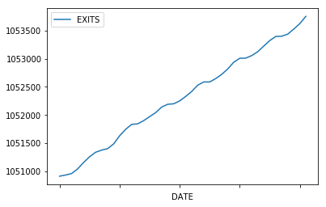

# Welcome to Greenpoint!

https://nahyongjun.github.io/Greenpoint/

## Demographics:

| Race                   | Total Number  | Percentage  |
| :--------------------: |:-------------:| :----------:|
| White                  | 26,691        | 76.9%       |
| Hispanic (of any race) | 5,099         | 14.7%       |
| Asian                  | 1,689         | 4.9%        |
| Two or more races      | 588           | 1.7%        |
| Black                  | 433           | 1.2%        |
| Other                  | 161           | 0.5%        |
| Native American        | 48            | 0.1%        |
| Pacific Islander       | 10            | 0.0%        |

----------------------------------------------------------

| Gender | Total Number | Percentage |
| :----: |:------------:| :---------:|
| Male   | 18,557       | 50.02%     |
| Female | 18,488       | 49.98%     |

## Graham Ave Subway Station: Turnstile #01-00-00

###### Entries:

###### Exits:

###### Difference betwwen Entries and Exits:

